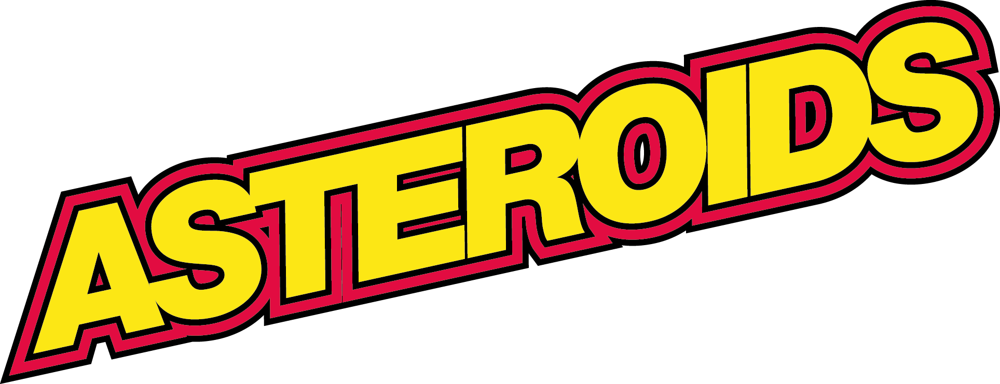

<p align="center">
  
</p>

## Introduction
This repository contains my project for the Component Based Software Engineering exam portfolio. 

The objective is to rebuild the classic game Asteroids using a component-based architecture.

[Asteroids](https://en.wikipedia.org/wiki/Asteroids_(video_game)) is a classic multi-directional shooter arcade video game released in November 1979 by Atari Inc. The game places the player in control of a spaceship navigating through an asteroid field while fending off enemy spaceships. The objective is to destroy asteroids and enemy ships while avoiding collisions and enemy fire. As the game progresses, the challenge increases with the increasing number and speed of asteroids.
## Getting Started
To run the game locally, follow these steps:
1. Clone the repository.
```console
git clone https://github.com/jlars22/AsteroidsFX.git
```
2. Navigate to the project directory.
```console
cd AsteroidsFX
```
3. Build the project.
```console
mvn clean install
```
4. Run the project.
```console
mvn exec:exec
```

## Usage
- Use the arrow keys to control the spaceship's movement.
- Press the spacebar to shoot and destroy asteroids (watch out for enemies).
- Avoid colliding with asteroids or being hit by enemy fire to stay alive.

## Technologies
- Java
- JavaFX
- Maven
